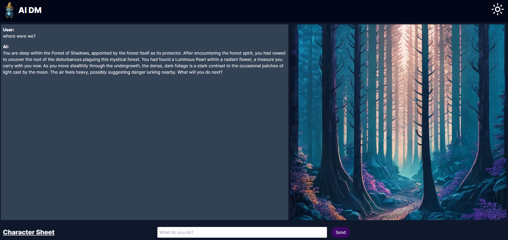

# AIDM: Play DND with chat GPT!

## Features
Persistant Adventure: Through the journaling and character statblock system, you can have adventures with baked-in continuity!

Do whatever you want: Use the power of modern llms to have the dnd story of your dreams!

Customize for your usecase: Easily editable code for changing prompt chains! (api/chat/route.ts -- edit the rules variable)

Unfortunately not deployed: Due to the inherent costs of running an app like this, I am not at this time interested in deploying this app.

## Tech Stack
AIDM is built with the following:

Frontend: The user interface of AIDM is handled with NextJS 13

Backend: The backend is powered by MongoDB and NextJS 13

## Getting Started
To get AIDM running locally on your machine, please follow the steps below:

Clone the repository to your local machine.

Install the dependencies by running npm install in your terminal.

Initialize your Mongodb Atlas cluster -- https://www.mongodb.com/atlas/database

Get an api key from Open AI -- https://platform.openai.com/overview (warning: not free)

Get an api key from Leonardo AI -- https://app.leonardo.ai/settings (warning: not free - you may want to not use this functionality or replace it with your own preferred model)

Set up an .env file with the necessary environment variables (outlined in exampleenv.txt).

To start the development server, run npm run dev in your terminal.

Visit localhost:3000 in your browser to view the application.

## Contributions
I welcome all kinds of contributions! Please feel free to contribute by opening issues, suggesting features, updating documentation, or even fixing bugs.

## License
AIDM is open-source and is licensed under the MIT License.

For any further questions, you can reach out to the me directly. Happy coding!
